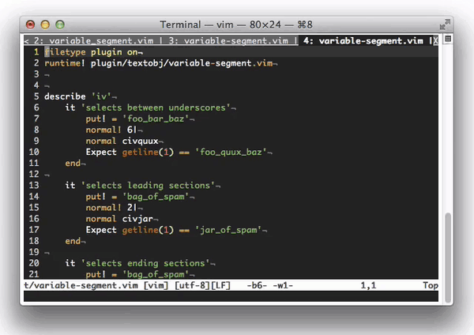

vim-tabs-grep
=============

Filters the output of `:tabs` to make it easier to find out which tab a file is
on.

## Demo

## License
Copyright © 2018 Teddy Wing. Licensed under the GNU GPLv3+ (see the included
COPYING file).
